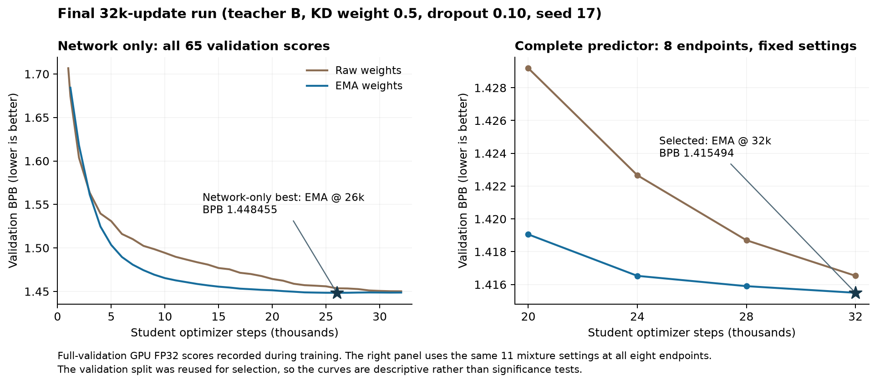

# A Distilled Transformer with Training-Derived Counts and a Gated Cache for WikiText-2

**DASE7506 Project 1 (Small Language Model Challenge).** Full-test CPU FP32 bits per byte (BPB): **1.431043** (supplied baseline: 2.101257).

## Abstract

We train a causal Transformer from random initialization on the supplied WikiText-2 training text. At inference it is combined with a fifth-order Kneser–Ney count model fitted on the same text and a continuous cache that copies from earlier positions of the current 256-token window. The network is an 8-block, width-256 model with rotary positions, RMSNorm and SwiGLU (6.95M parameters). It is trained for 32,000 updates with knowledge distillation from a two-member teacher ensemble. With the same number of processed training targets as the baseline (9.83M), a larger network of this architecture, trained without distillation, cache or counts, lowers validation BPB from 2.071 to 1.730. The final predictor reaches 1.415455 validation BPB and **1.431043 test BPB**. On the test split its CPU scoring time is 4.24× the baseline, with peak RAM 1.67 GiB and inference assets of 44.4 MiB. An ablation on the final checkpoint shows that the cache contributes most of the gain over the network alone. Most of the cache's benefit depends on a similarity gate that restricts when it copies.

## 1. Task, protocol and constraints

The benchmark scores every target of a split exactly once, using independent causal windows of 256 targets with no state carried across windows. BPB is the summed negative log-likelihood divided by the split's raw UTF-8 byte count B:

$$
\mathrm{BPB} = \frac{-\sum_t \ln p(x_{t+1} \mid x_{\le t})}{B \ln 2}
$$

Validation has 376,599 targets and 1,148,007 bytes; test has 428,405 targets and 1,292,013 bytes. The tokenizer (BPE, 2,048 tokens), data, baseline model and scorer are used unchanged; `verify_integrity.py` checks their hashes against the course manifest.

Evaluation limits are CPU scoring time at most 5× the baseline, peak RAM at most 4 GiB, and at most 64 MiB of uncompressed inference assets. Weights and count statistics are fitted only on training text. All model, checkpoint and hyperparameter choices use validation. The final predictor was frozen, with SHA-256 hashes of every inference file recorded, before the test split was scored (Section 7).

Hardware: one RTX 4070 (12 GB) for training, and a Ryzen 5 7600 (4 threads) for CPU scoring, with PyTorch 2.7.1. Training uses BF16 autocast, except the two FP32 runs in Section 3. All reported scores use FP32. All runs use seed 17, so the comparisons are controlled but do not measure seed variance.

## 2. Method

### 2.1 Network

The baseline is a 4-block, width-128 GPT with learned positions, LayerNorm, GELU MLPs and tied embeddings (1,088,256 parameters). `student.py` keeps causal self-attention and tied embeddings, and replaces the rest with rotary position embeddings [2], RMSNorm [3] and a SwiGLU feed-forward block [4]. Linear layers have no biases, and residual output projections are initialized with a 1/sqrt(2L) scale. The final network has 8 blocks, width 256, 4 heads and MLP width 704 (6,951,168 parameters). It uses residual and embedding dropout 0.10 during training.

Training uses batches of 32×256 targets, AdamW (learning rate 1e-3, β2 = 0.95, weight decay 0.1), 200 warmup steps, cosine decay to 5% of the peak rate, and gradient clipping at 1.0. An exponential moving average (EMA) of the weights with decay 0.999 starts at step 1,000. Checkpoints are compared as raw weights or EMA weights on validation.

### 2.2 Knowledge distillation

WikiText-2 training text has about 3.6M tokens, so a 32k-update run makes roughly 73 passes over it. With only hard labels, larger networks overfit early (Section 4.1). We therefore train the student on

$$
\mathcal{L} = (1-\lambda)\,\mathrm{CE}(y, p_S) + \lambda\,\mathrm{KL}(q \,\|\, p_S), \qquad \lambda = 0.5
$$

where q is a frozen teacher's distribution on the same training window [8]. The KL is summed over the vocabulary and averaged over tokens. Teachers only produce training targets and are not part of the submitted predictor.

Teachers are probability mixtures of trained models with a shared temperature. **Teacher A** mixes two directly trained models (6×288 and 8×256, both with dropout 0.25 for 20k updates) with equal weights at temperature 1.15; it reaches 1.4439 validation BPB. A student distilled from teacher A (dropout 0.15) then becomes a member of **teacher B**: 0.25 × direct 6×288 + 0.75 × distilled student, at temperature 1.05 (1.4345 BPB). The weights and temperatures of both teachers were chosen by small validation searches. Teacher B has the lower validation BPB, and it is used for the final model. The final student's dependency on teacher training (491.52M targets) is counted in its cost (Section 6).

### 2.3 Count model

`fit_ngram.py` fits an interpolated modified Kneser–Ney model of order 5 [5] on the training tokens only. Orders 3–5 prune n-grams seen once, and the removed mass goes to the back-off distribution. The unigram distribution uses continuation counts with a small floor, so every token keeps non-zero probability. The packed table is 18.7 MB and is never updated during evaluation. A unit test checks the packed implementation against an independent dictionary-based estimator on a synthetic Markov source.

### 2.4 Gated continuous cache

The cache [6] stores, for each earlier position j in the current window, the final-layer hidden state z_j together with the token that followed it. Predicting position t may use only keys with j < t, whose successors are already observed tokens:

$$
p_C(w) = \sum_{j<t} \frac{\exp(\tau \cos(z_t, z_j))}{\sum_{r<t}\exp(\tau \cos(z_t, z_r))}\,\mathbf{1}[x_{j+1}=w], \qquad \tau = 12
$$

Two gates switch the cache off. It needs at least 32 earlier positions, and at least one earlier key must reach a cosine similarity of 0.7 with the current state. The state is reset for every window, row and call. Unit tests check causality, reset between windows, batch independence and normalization.

### 2.5 Mixture and calibration

The network's logits are divided by a temperature T = 1.05, then mixed in probability space:

$$
p = (1-\beta_t)\,[(1-\alpha_t)\,p_N + \alpha_t\,p_C] + \beta_t\,p_G
$$

where p_N is the network, p_C the cache and p_G the count model. The cache weight is α = 0.15 when both gates pass and 0 otherwise. The count weight is β = 0.10 for the first 64 positions of a window, where the network has little context, and 0.05 after that. These scalars were chosen on validation with a bounded grid search of 44,980 settings.

### 2.6 CPU inference scheduling

On CPU, the scorer runs the Transformer on 8 windows at a time and mixes the vocabulary-sized outputs in chunks of 4 windows, in place, with a restructured count mixture. Compared with the unscheduled implementation, it changed log-probabilities by at most 1.9e-6 on an earlier checkpoint. On the final checkpoint, validation BPB differs by 8e-11. On an otherwise idle machine, it lowered the time ratio by 3.4–4.0% in two measurement sessions. Chunking never mixes information between windows; tests check batch independence.

## 3. Equal-target comparison with the baseline

Both runs use the original `train.py` and seed 17 with 1,200 updates of 32×256 targets, i.e. 9,830,400 targets each. The student is a 6×256 network with the Section 2.1 architecture (dropout 0.15), without distillation, cache or counts.

| Model | Parameters | Validation BPB | Training time |
|---|---:|---:|---:|
| Supplied baseline (4×128) | 1,088,256 | 2.071081 | 14.3 s |
| Student architecture (6×256) | 5,344,512 | 1.729963 | 52.0 s |

At equal processed targets, validation BPB drops by 0.341. The student also has 4.9× more parameters and takes 3.6× longer to train. This comparison measures the combined architecture change, not RoPE, RMSNorm or SwiGLU in isolation.

## 4. Development results

### 4.1 What improved the model

All numbers below are full-validation GPU FP32 BPB. "Complete" is the full predictor (network, cache and counts) with its own bounded selection of mixture settings. Unless stated otherwise, students are 8×256 models trained for 20k updates (163.84M targets).

| Training recipe | Network BPB | Complete BPB |
|---|---:|---:|
| Hard labels, dropout 0.25 | 1.502327 | 1.448368 |
| Distillation from teacher A (λ 0.5), dropout 0.25 | 1.459669 | 1.433789 |
| Same, λ 0.75 | 1.465096 | 1.440240 |
| Teacher A, dropout 0.15 | 1.452585 | 1.424654 |
| Teacher A, dropout 0.10 | 1.455837 | 1.423626 |
| Teacher B, dropout 0.15 | 1.454286 | 1.423630 |
| Teacher B, dropout 0.10 | 1.455353 | 1.420550 |
| Same, plus 4k updates at learning rate 5e-5 → 1e-5 | 1.453788 | 1.419230 |
| **Teacher B, dropout 0.10, 32k-update schedule (final)** | **1.448716** | **1.415455** |

The teacher A, dropout 0.15 row uses the same standard mixture search as the rows below it. It was once the best candidate, and an extra 60-setting search run only for it later brought it to 1.424375.

Four effects stand out.

1. **Distillation** gives the largest training-side gain: 0.043 network BPB at equal updates. A 12×512 teacher trained directly was worse: its best EMA checkpoint (1.5349 at 5k updates) degraded to 1.863 by 20k, and it did not improve the teacher mixture. On this small corpus, a mixture of two moderately sized models gave better targets (lower validation BPB) than a larger model.
2. **Lower dropout helps the complete predictor, not the network.** Going from dropout 0.15 to 0.10 makes the network slightly worse but the complete predictor better. The cache matches hidden states by cosine similarity, and less-noised representations appear to make these matches more reliable. This is a plausible explanation that we did not test directly.
3. **A better teacher and lower dropout combine.** Together, teacher B and dropout 0.10 gain 0.0041 over teacher A with dropout 0.15. That is more than the sum of the two separate gains (about 0.0010 each).
4. **Longer training helps up to about 73 epochs.** A 4k-update low-learning-rate continuation of the 20k model gained 0.0013. We then retrained with a full 32k-update cosine schedule. Compared with the 20k run it improves the network by 0.0066 and the complete predictor by 0.0051. The raw weights and the complete predictor keep improving to the end of the schedule; the EMA network flattens after about 26k updates (Figure 1).

### 4.2 Final model selection

For the 32k run we fixed four endpoints in advance (20k, 24k, 28k and 32k, each as raw and EMA weights). We scored all eight with the complete predictor at fixed mixture settings, taken from the previous best model. EMA at 32k was best (1.415494). The network-only optimum was EMA at 26k (1.448455). It was not one of the pre-selected endpoints, so it was not scored as a complete predictor. One bounded 44,980-setting search then changed only the minimum cache history, from 16 to 32. This gained 3.9e-5, which is small enough to be selection noise, so nearly all of the improvement comes from training.

### 4.3 What did not help

- **Out-of-fold teachers.** We tested whether teachers that memorised the student's training windows give misleading targets. We trained two half-data teachers and routed each window either to the teacher that had not seen it (out-of-fold) or to the one that had (in-fold). All other randomness was matched. In-fold was better, 1.4927 versus 1.4995 network BPB, and both students were far worse than full-data distillation (complete 1.4468 / 1.4535). Teacher quality mattered more than avoiding memorised targets.
- **Weight averaging** [7]. EMA helped, but averaging snapshots of one run never beat its best raw/EMA checkpoint. Linear interpolation between two separately distilled students showed a loss barrier: the best mixture reached 1.4699, worse than either endpoint.
- **More distillation weight** (λ = 0.75 instead of 0.5) was worse. **More dropout** (0.25 instead of 0.15) was also worse for distilled students.
- **A 9-block network** was not trained. Earlier sessions of the 8-block predictor measured 4.46–4.58× the baseline time. That left too little margin under our self-imposed 4.8× limit for 12.5% more compute.

## 5. Mechanism ablation and resources

### 5.1 Ablation on the final checkpoint

We removed one mechanism at a time from the frozen predictor and kept every other setting fixed (CPU FP32, full validation).

| Predictor | Validation BPB |
|---|---:|
| Network only, T = 1 | 1.448716 |
| Network only, calibrated T = 1.05 | 1.443491 |
| Network + counts | 1.437719 |
| Network + cache | 1.421106 |
| **Complete predictor** | **1.415455** |
| Complete, without the similarity gate | 1.431185 |
| Complete, without the early count weight | 1.415825 |
| Counts alone | 1.788794 |

Relative to the calibrated network, the cache contributes 0.0224 BPB and the counts contribute 0.0058; their gains are largely additive (together 0.0280). Wikipedia articles repeat names, numbers and phrases within a few hundred tokens, which a 7M-parameter network cannot memorise but can recognise in context. The similarity gate is essential. Without it, the cache copies from unrelated contexts and loses 0.0157 of its benefit. The count model is weak alone (1.789) but corrects rare training-set phrases the network under-predicts. The larger early count weight matters little (0.0004).

### 5.2 Resource use

Timing uses the course procedure on an otherwise idle machine: CPU FP32, 4 threads, one warm-up pair, then three alternating baseline/candidate pairs. The reported value is the ratio of the median scoring times. We required two independent sessions to stay at or below 4.8×, a margin under the 5× limit.

| Measurement | Result | Limit |
|---|---:|---:|
| CPU time ratio, validation sessions 1 / 2 | 4.255 / 4.232 | 5 |
| CPU time ratio, test campaign (6.18 s baseline, 26.17 s model) | 4.235 | 5 |
| Peak process-tree RAM | 1,796,526,080 B (1.67 GiB) | 4 GiB |
| Inference assets: checkpoint + count table + code | 46,549,381 B (44.4 MiB) | 64 MiB |

The ratio varies by up to about 0.3 between sessions. Before the re-save described in Section 7, the same predictor measured 4.250× and 4.284×. Earlier checkpoints with identical architecture and code measured 4.49–4.58×. Every session stayed below 5×. The Transformer dominates scoring time. An informal profile of an earlier build put the count path at about 4–6% of runtime, and the cache adds one similarity product per position. The count table is 40% of the inference assets, and the network weights are most of the rest. The model has 6.4× the baseline's parameters for 4.2× its scoring time, because batched matrix multiplications scale better than the baseline's small layers.

## 6. Final result and cost

| | Validation BPB | Test BPB |
|---|---:|---:|
| Supplied baseline | 2.071081 | 2.101257 |
| **Final predictor (CPU FP32)** | **1.415455** | **1.431043** |

Test BPB is 31.9% lower than the baseline's. The test/validation ratio of targets to bytes is 1.0108 times higher, so equal loss per target would give 1.4307 on test. The measured 1.4310 is within 0.03% of that. Every candidate test pass gave the identical score, and a fresh run of `evaluate.py` from the released repository reproduces it exactly.

**Costs.** The final model's own training ancestry is 753,664,000 optimizer targets. That is 262,144,000 for the 32k student plus 491,520,000 for its teachers, with shared ancestors counted once. Its 32k run took 25.4 minutes on the RTX 4070 and processed 524,288,000 teacher-member forward targets. The whole project executed at least 2,772,795,392 optimizer targets, including failed and superseded runs. That work took at least 16,157 s (4.5 h) of GPU training and 1,605,632,000 teacher queries. Hyperparameter search evaluated 646,300 mixture settings across 105 selection runs (775 s), at least 82 teacher-mixture settings and 20 checkpoint averages. CPU resource measurements used 170 full scoring calls. All development selections reused one validation split.

The trade-off is favorable within the rules. The final student uses 27× the baseline's training targets (77× including its teachers) and 4.2× its scoring time. This buys a 0.656 reduction in validation BPB (0.670 on test). Of the validation reduction, 0.341 comes from the architecture at the baseline's training budget. Another 0.281 comes from longer training, a larger network and distillation. The last 0.033 comes from calibration and inference-time mixing.

## 7. Selection, freezing and limitations

Candidates were ranked by complete CPU validation BPB among those passing the resource margin. Before the test split was scored, `freeze_candidate.py` wrote `checkpoints/final/freeze.json`. It holds SHA-256 hashes of 20 files: the checkpoint, the six inference source files, the data, the count table, the five freeze and measurement tools, and the validation/resource evidence. `verify_frozen.py` checks all 20 files before and after scoring.

One deviation from our own plan: it set an internal deadline of 08:30 (UTC+8) for the final model's two resource sessions. The AI assistant running the measurements ran out of usage quota, so the sessions ran at 09:56–10:04 instead. Before any test result existed, I decided to accept them under the unchanged 4.8× rule. Otherwise the previously qualified model (the 24k-update continuation, validation 1.419230) would have been submitted. The freeze (10:20) and the test campaign (10:22–10:26) followed. The test campaign made four identical passes of the model. A later reproduction run from this repository gave the same score.

After the test, the checkpoint was re-saved with minimal metadata; the original stored local file paths and internal notes. One comment line in `hybrid.py` was also reworded. Weights, configuration and computation are unchanged. All ablation rows in Section 5.1 are bit-identical, and so are the per-window test losses. Because file hashes changed, the resource sessions, the freeze (13:26) and the test campaign (13:26–13:30) were repeated for the released files, again giving test BPB 1.4310428473355665.

Limitations: every comparison uses one seed, and the validation split was reused for many selection decisions, so small differences (below about 0.001 BPB) should not be over-interpreted. BF16 training is not bitwise reproducible, so retraining reproduces the recipe, not identical weights. CPU time ratios depend on the machine. The dropout–cache interaction in Section 4.1 is a hypothesis, not an established mechanism.

## 8. Acknowledgements and AI use

The course supplied the baseline, trainer, scorer, tokenizer, data and contract tests. No external text or pretrained weights were used. WikiText-2 is by Merity et al. [1], with text by Wikipedia contributors under CC BY-SA 3.0 and GFDL.

AI assistants (OpenAI Codex and Anthropic Claude) were used substantially. They wrote most of the code, proposed and ran experiments, ran the final measurements, freeze and test, and drafted this report. I directed the work and made the key decisions. Section 9 of the repository README gives the details.

## References

[1] S. Merity, C. Xiong, J. Bradbury, R. Socher. Pointer Sentinel Mixture Models. arXiv:1609.07843, 2016.

[2] J. Su et al. RoFormer: Enhanced Transformer with Rotary Position Embedding. arXiv:2104.09864, 2021.

[3] B. Zhang, R. Sennrich. Root Mean Square Layer Normalization. NeurIPS, 2019.

[4] N. Shazeer. GLU Variants Improve Transformer. arXiv:2002.05202, 2020.

[5] S. Chen, J. Goodman. An Empirical Study of Smoothing Techniques for Language Modeling. Harvard TR-10-98, 1998.

[6] E. Grave, A. Joulin, N. Usunier. Improving Neural Language Models with a Continuous Cache. ICLR, 2017.

[7] P. Izmailov et al. Averaging Weights Leads to Wider Optima and Better Generalization. UAI, 2018.

[8] G. Hinton, O. Vinyals, J. Dean. Distilling the Knowledge in a Neural Network. arXiv:1503.02531, 2015.

